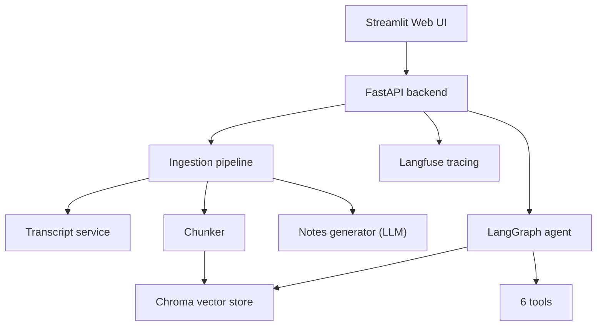
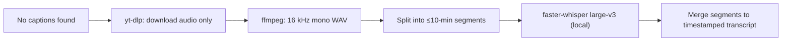

# Lekhak — Technical Requirements Document (TRD)

> **Document status:** v1.0 (frozen scope)
> **Owner:** Vishal
> **Last updated:** 31 May 2026

**Purpose:** Define every technical requirement for Lekhak v1 with concrete, testable values. There are no open-ended requirements in this document — every value is fixed for v1. Changes require a version bump.

---

## 1. Product summary

Lekhak is a web application that converts YouTube lectures into structured notes, flashcards, and a quiz, and provides an agentic study companion to chat with the lecture and schedule revision.

---

## 2. Scope

### 2.1 In scope (v1)

- Single YouTube video ingestion (one URL per job).
- English-language lectures only.
- Videos up to 180 minutes in duration.
- Structured notes, 10 flashcards, and a 5-question quiz per lecture.
- RAG-based chat over a single lecture.
- Agentic study companion with the 6 tools defined in §7.1.
- Local persistence and a single-instance web deployment.
- 100% open-source / open-weight stack that runs locally (no proprietary model APIs).

### 2.2 Out of scope (v1 — explicitly excluded)

- Playlists or batch ingestion of multiple videos in one job.
- Non-English languages.
- User accounts, authentication, or multi-user data isolation.
- Payments or subscriptions.
- Mobile / native apps.
- Model fine-tuning or training.
- Uploading local video / audio files (YouTube URL only in v1).

---

## 3. Definitions

- **Lecture:** one YouTube video processed in a single job.
- **Chunk:** a contiguous transcript segment of fixed token size with timestamp metadata.
- **Golden set:** the fixed 20-item evaluation dataset used as release gates (§10).
- **Job:** one end-to-end ingestion run for a single lecture.

---

## 4. System architecture

---

## 5. Technology stack (pinned for v1)

> 100% open-source / open-weight. Every model and tool below is open source and runs locally — no proprietary model APIs. This is deliberate: the goal is to learn the entire stack, including self-hosted inference.

| Component | Choice | Version |
| --- | --- | --- |
| Language | Python | 3.11.x |
| Backend API | FastAPI | 0.115.x |
| Frontend | Streamlit | 1.39.x |
| Orchestration | LangChain | 0.3.x |
| Agent framework | LangGraph | 0.2.x |
| Vector DB | Chroma (persistent, local) | 0.5.x |
| Embeddings | BAAI/bge-base-en-v1.5 (768 dims) | HF |
| Notes / chat LLM | Llama-3.1-8B-Instruct (via Ollama) | open weights |
| Judge LLM (evals) | Qwen2.5-14B-Instruct (via Ollama) | open weights |
| Transcription | faster-whisper large-v3 (local fallback) | 1.0.x |
| Model serving | Ollama (LLMs) + sentence-transformers (embeddings / reranker) | 0.3.x / 3.x |
| Reranker | BAAI/bge-reranker-base | HF |
| Audio download | yt-dlp | 2024.08.x |
| Eval library | Ragas | 0.2.x |
| Observability | Langfuse | 2.x |
| Containerization | Docker | 24.x |

---

## 6. Functional requirements

### 6.1 Ingestion & transcript (FR-1xx)

| ID | Requirement | Acceptance criterion |
| --- | --- | --- |
| FR-101 | Accept exactly one YouTube URL per job via the UI. | A valid `youtube.com/watch?v=` or `youtu.be/` URL is accepted; any other input is rejected with message "Invalid YouTube URL". |
| FR-102 | Reject videos longer than 180 minutes. | Videos with duration > 10800 seconds return error "Video exceeds 180-minute limit" and no job starts. |
| FR-103 | Fetch captions via YouTube Transcript API first. | If captions exist, they are used; Whisper is not called. |
| FR-104 | Fallback to local faster-whisper when captions are absent. | Audio is downloaded with yt-dlp, converted to 16 kHz mono WAV with ffmpeg, and transcribed locally with faster-whisper large-v3; a timestamped transcript is produced. |
| FR-105 | Clean the transcript. | Filler tokens in the set {um, uh, you know, like, so} at sentence start are removed; output has sentence casing and terminal punctuation. |
| FR-106 | Delete raw audio after transcription. | The downloaded audio file is deleted within 60 minutes of job completion; only transcript text persists. |

#### 6.1.1 Transcript fallback — how Whisper is used

When YouTube has no captions (FR-103 misses), Lekhak generates the transcript itself with a local, open-source Whisper model. No audio or text leaves your machine.

- faster-whisper is the open-source CTranslate2 reimplementation of OpenAI's Whisper (MIT-licensed open weights); it runs the same models 3–4× faster on CPU or a small GPU.
- It returns text with segment timestamps, which are stored as the `start_ts` / `end_ts` chunk metadata (FR-202).
- Long audio is segmented first so each call is bounded and independently retryable (FR-604).

### 6.2 Chunking & indexing (FR-2xx)

| ID | Requirement | Acceptance criterion |
| --- | --- | --- |
| FR-201 | Chunk transcript at 800 tokens with 120-token overlap. | No chunk exceeds 800 tokens; consecutive chunks overlap by 120 tokens (±10). |
| FR-202 | Store metadata per chunk. | Each chunk record contains: `chunk_id`, `video_id`, `start_ts`, `end_ts`, `token_count`. |
| FR-203 | Embed chunks with BAAI/bge-base-en-v1.5 (sentence-transformers). | Every chunk has a 768-dimension vector stored in Chroma. |
| FR-204 | One Chroma collection per video, cosine distance. | Collection name = `video_id`; distance metric = cosine. |

### 6.3 Notes generation (FR-3xx)

| ID | Requirement | Acceptance criterion |
| --- | --- | --- |
| FR-301 | Generate notes with Llama-3.1-8B-Instruct (served via Ollama) at temperature 0.2. | Calls use `model=llama3.1:8b-instruct`, `temperature=0.2`, `max_tokens=4000`. |
| FR-302 | Use map-reduce for lectures over 8000 transcript tokens. | Each section is summarized, then a final synthesis call produces the notes. |
| FR-303 | DSA template output structure. | Notes contain these exact sections: Problem Statement, Intuition, Brute Force, Better, Optimal (each with Time & Space Complexity), Key Insight, Edge Cases, Notes from video, Related Problems. |
| FR-304 | Generic template for non-DSA lectures. | If DSA template is not selected, notes contain: Overview, Key Concepts, Details, Summary. |
| FR-305 | Timestamp citations. | Every top-level section includes at least one `[mm:ss]` timestamp referencing the source moment. |

### 6.4 Flashcards & quiz (FR-4xx)

| ID | Requirement | Acceptance criterion |
| --- | --- | --- |
| FR-401 | Generate exactly 10 flashcards. | Output JSON array length = 10; each item has non-empty `front` and `back` strings. |
| FR-402 | Generate exactly 5 multiple-choice quiz questions. | Output JSON array length = 5; each item has `question`, `options` (length 4), one `correct_index` (0–3), and `explanation`. |
| FR-403 | Strict JSON validity. | Flashcard and quiz outputs parse as valid JSON against the published schema with zero parse errors. |

### 6.5 RAG chat (FR-5xx)

| ID | Requirement | Acceptance criterion |
| --- | --- | --- |
| FR-501 | Hybrid retrieval (dense + BM25). | Both dense (cosine) and BM25 retrievers run; results are fused before reranking. |
| FR-502 | Retrieve top-5, rerank to top-3. | Fused candidate set = 5; bge-reranker-base returns the 3 highest-scoring chunks to the LLM. |
| FR-503 | Context budget cap. | Total tokens sent to the LLM (retrieved chunks + prompt) ≤ 8000. |
| FR-504 | Cited answers. | Every chat answer includes at least one `[mm:ss]` timestamp from the retrieved chunks. |

---

## 7. Agent requirements (FR-6xx)

| ID | Requirement | Acceptance criterion |
| --- | --- | --- |
| FR-601 | Implement the agent in LangGraph. | Agent is a LangGraph state graph with explicit tool nodes. |
| FR-602 | Cap tool-call iterations at 8 per user turn. | The agent terminates after at most 8 tool calls and returns a response. |
| FR-603 | Retry transient tool failures up to 2 times. | Failed tool calls retry with exponential backoff (1s, 2s); after 2 retries the agent returns a graceful error message. |
| FR-604 | Whisper segmentation & retry. | Audio is always split into ≤10-minute segments before transcription; each segment must complete within 300 seconds or it is retried once before the job fails. |

### 7.1 Tool catalog (exact signatures)

| Tool | Input | Output |
| --- | --- | --- |
| `get_transcript` | `video_id: str` | `transcript: str` |
| `generate_notes` | `video_id: str, template: "dsa" \| "generic"` | `notes_markdown: str` |
| `search_lecture` | `video_id: str, query: str` | `chunks: list` (max 3) |
| `make_quiz` | `video_id: str` | `quiz_json: str` (5 items) |
| `make_flashcards` | `video_id: str` | `flashcards_json: str` (10 items) |
| `schedule_revision` | `video_id: str, intervals_days: [1, 3, 7]` | `calendar_entries: list` |

---

## 8. Non-functional requirements (NFR)

| ID | Requirement | Target value |
| --- | --- | --- |
| NFR-1 | Notes latency for a 60-minute lecture. | ≤ 120 seconds (p95) |
| NFR-2 | Chat response latency. | ≤ 8 seconds (p95) |
| NFR-3 | Hardware footprint (peak VRAM) for the full pipeline. | ≤ 16 GB on a single GPU; CPU-only fallback supported |
| NFR-4 | Concurrent ingestion jobs supported. | 5 |
| NFR-5 | Deployed availability (single instance, best-effort). | 99% monthly |
| NFR-6 | Per-user request rate limit. | 20 requests / minute |
| NFR-7 | Notes streaming to UI. | First token visible ≤ 5 seconds after generation starts |

---

## 9. Data requirements

- **Transcript record:** `video_id` (str), `title` (str), `duration_sec` (int), `language` ("en"), `source` ("captions" | "faster-whisper"), `text` (str).
- **Chunk record:** `chunk_id` (str), `video_id` (str), `text` (str), `start_ts` (int sec), `end_ts` (int sec), `token_count` (int), `embedding` (float[768]).
- **Notes record:** `video_id` (str), `template` (str), `markdown` (str), `created_at` (ISO-8601).
- **Retention:** transcripts, chunks, and notes persist indefinitely on local disk; raw audio is deleted within 60 minutes (FR-106).
- **Storage backend:** Chroma persistent client at path `./data/chroma`; notes / transcripts as JSON at `./data/records`.

---

## 10. Evaluation requirements (release gates)

All gates run against the fixed 20-item golden set. v1 cannot ship unless every gate passes.

| ID | Metric | Pass threshold |
| --- | --- | --- |
| EV-1 | Retrieval Recall@5 | ≥ 0.85 |
| EV-2 | Retrieval MRR | ≥ 0.75 |
| EV-3 | Note quality (Qwen2.5-14B-Instruct judge, 1–5 rubric) | ≥ 4.0 average |
| EV-4 | Faithfulness (% claims grounded) | ≥ 95% |
| EV-5 | Quiz schema validity | 100% |
| EV-6 | Quiz answerability & correctness | ≥ 90% |

---

## 11. Security & privacy

- **SR-1:** All secrets (e.g., Langfuse keys) are read from environment variables; no secret appears in source code or logs. The LLM, embedding, and transcription models run locally and need no external API keys.
- **SR-2:** The deployed app is served over HTTPS only.
- **SR-3:** No raw audio is retained beyond 60 minutes (FR-106).
- **SR-4:** Logs store request metadata (latency, token count, cost) but never full transcripts.

---

## 12. Observability

- **OB-1:** Every LLM and tool call is traced in Langfuse with input / output, latency, and token counts.
- **OB-2:** Per-job token counts and total inference time (transcription, embedding, generation) are computed and logged.
- **OB-3:** A daily summary logs job count, average latency, and average inference time per job.

---

## 13. Deployment

- **DP-1:** The app builds into a single Docker image from a pinned `requirements.txt`.
- **DP-2:** v1 is deployed to Render (single web service, 1 instance).
- **DP-3:** The eval suite (§10) runs in CI on every push to `main`; a failing gate blocks deploy.

---

## 14. Milestones (tied to the action plan phases)

| Milestone | Definition of done |
| --- | --- |
| M0 — MVP | URL → transcript → single-prompt notes on screen (no vector DB, no agent). |
| M1 — RAG | FR-2xx, FR-3xx, FR-5xx implemented; EV-1–EV-4 pass. |
| M2 — Agent | FR-6xx and all 6 tools implemented; agent passes failure-recovery test. |
| M3 — Production | All NFRs met; OB-1–OB-3, DP-1–DP-3 complete; deployed publicly. |
